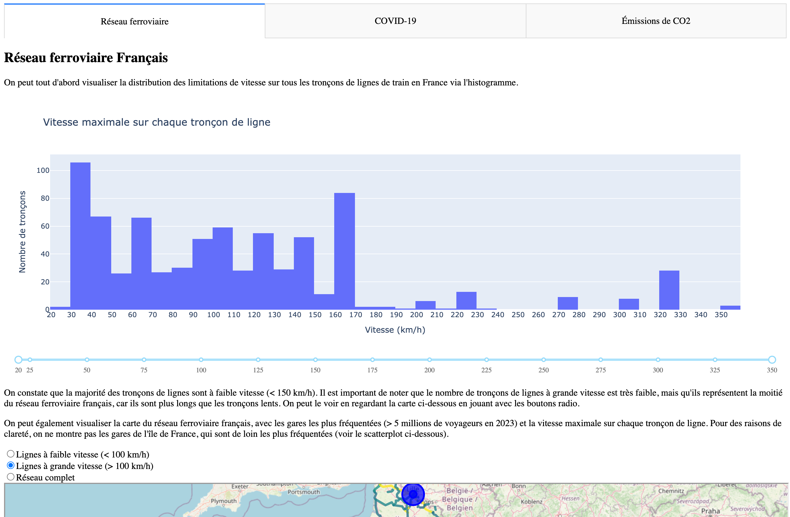

# DSIA_4101A Analyse des données de la SNCF

## Aperçu du projet

Ce projet est un projet d'analyse de données de la SNCF provenant de <https://ressources.data.sncf.com>. Il vise à explorer et analyser les données relatives aux lignes de train, aux émissions de CO2, à la fréquentation des gares, à la vitesse maximale sur les lignes.

## User Guide

### Clonage

Pour cloner le projet, exécutez la commande suivante :

```bash
git clone
````

### Dépendances

La version de Python utilisée pour ce projet est 3.12.5.

Pour installer les dépendances, exécutez la commande suivante :

```bash
pip install -r requirements.txt
```

### Obtention des données

On peut obtenir les données en exécutant le script `get_data.py`. Ce script télécharge les données de la SNCF et les enregistre dans le répertoire `data/raw`. Le détail des provenances des données est disponible dans le fichier `data/provenance.md`.

```bash
python get_data.py
```

### Prétraitement des données

Le prétraitement des données est effectué dans le script `treat_data.py`. Ce script nettoie et prépare les données pour l'analyse. Il enregistre les données prétraitées qui sont nécessaires pour le dashboard dans le répertoire `data/processed`.

```bash
python treat_data.py
```

### Lancement du dashboard

Le dashboard peut être lancé en exécutant le script `main.py`. Ce script démarre un serveur web local et ouvre le dashboard dans votre navigateur par défaut.

```bash
python main.py
```

Pour accéder au dashboard, ouvrez votre navigateur et allez à l'adresse suivante : [http://localhost:8050](http://localhost:8050).

## Data

Les données utilisées dans ce projet consistent en 7 fichiers. 5 d'entre eux proviennent de la SNCF, une de [data.gouv.fr](https://data.gouv.fr) et une du site de monsieur Courivaud. Le détail de la provenance des données est disponible dans le fichier `data/provenance.md`.
Elles sont disponibles dans le répertoire `data/raw` après exécution du script `get_data.py`.

Voici le détail des fichiers :

- `formes-des-lignes-du-rfn.geojson` décrit les formes des lignes du réseau ferré national (RFN). On peut s'en servir pour afficher les lignes sur une carte.
- `vitesse-maximale-nominale-sur-ligne.geojson` décrit les limites de vitesse sur les lignes du RFN.
- `liste-des-gares.geojson` décrit les gares du RFN, avec leur nom, leur code UIC, leurs coordonnées géographiques, etc.
- `frequentation-gares.csv` décrit la fréquentation des gares du RFN, avec le nombre de voyageurs par an entre 2015 et 2023.
- `emission-co2-perimetre-complet.csv` décrit les émissions moyennes de CO2 en fonction de différents trajets sur le RFN. On peput ainsi comparer les émissions de CO2 en fonction du moyen de transport utilisé (Avion, TGV, Voiture, etc.).
- `20230823-communes-departement-region.csv` décrit les communes, départements et régions de France. On peut s'en servir pour faire une jointure avec les données des gares pour trouver la région du'ne gare par exemple.
- `insee-pop-communes.csv` décrit la population des communes de France. On peut s'en servir pour faire une jointure avec les données des gares pour trouver la population de la ville où se trouve une gare.

## Exploration des données

L'exploration des données et la création de graphiques simples sont entièrement documentées dans les notebooks situés dans le répertoire `notebooks`. Ces notebooks sont au format Jupyter et peuvent être ouverts avec Jupyter Notebook ou Jupyter Lab.
Les notebooks sont numérotés dans l'ordre d'exécution. Ils permettent de mieux comprendre les choix faits notamment pour le prétraitement des données, ainsi que des premières versions des graphiques qui apparaissent dans le dashboard.

## Developer guide

La structure du projet est la suivante :

```bash
.
├── README.md
├── config
│   └── sources.json
├── data
│   ├── processed
│   │   ├── emissions.csv
│   │   ├── gares_communes.geojson
│   │   └── shapes_speeds.geojson
│   ├── provenance.md
│   └── raw
│       ├── 20230823-communes-departement-region.csv
│       ├── emission-co2-perimetre-complet.csv
│       └── ...
├── get_data.py
├── main.py
├── notebooks
│   ├── 1_shapes.ipynb
│   ├── 2_speeds.ipynb
│   ├── 3_merge_shapes_speeds.ipynb
│   └── ...
├── requirements.txt
├── resources.md
├── src
│   ├── __init__.py
│   ├── charts
│   │   ├── __init__.py
│   │   ├── covid.py
│   │   ├── emissions.py
│   │   └── reseau.py
│   └── data_processing_utils.py
└── treat_data.py
```

Les données sont stockées dans le répertoire `data`. Les données brutes sont stockées dans le répertoire `data/raw` et les données traitées sont stockées dans le répertoire `data/processed`. Le fichier `config/sources.json` contient les sources des données. 

Les notebooks sont stockés dans le répertoire `notebooks`. Ils sont numérotés dans l'ordre d'exécution. Ils permettent de mieux comprendre les choix faits notamment pour le prétraitement des données, ainsi que des premières versions des graphiques qui apparaissent dans le dashboard.
Le fichier `requirements.txt` contient les dépendances du projet. J'invite **fortement** à consulter ces notebooks qui constituent une part importante de la documentation du projet.

Le fichier `get_data.py` permet de télécharger les données brutes et de les stocker dans le répertoire `data/raw`. Le fichier `treat_data.py` permet de traiter les données brutes et de les stocker dans le répertoire `data/processed`. Le fichier `main.py` permet de lancer le dashboard.

Le fichier `src/data_processing_utils.py` contient les fonctions utilitaires pour le traitement des données. Il est appelé par le fichier `treat_data.py`. Le répertoire `src/charts` contient les fichiers pour la création des graphiques, et des tabs pour le dashboard. Ils sont appelés par le fichier `main.py`. Chaque fichier contient des fonctions pour créer des graphiques, et une fonction pour tous les assembler dans un layout dash. Si on veut créer un nouveau graphique dans un tab qui existe déjà, il suffit de créer une nouvelle fonction dans le fichier correspondant. Si on veut créer un nouveau tab, il faut créer un nouveau fichier dans le répertoire `src/charts` et l'importer dans le fichier `main.py`. Il faut aussi ajouter le tab dans le layout du dashboard.

## Rapport d'Analyse

En ouvrant le dashboard, on tombe sur ça :



Le dashboard est divisé en 3 onglets :

### Réseau ferroviaire

L'onglet "Réseau ferroviaire" fournit une analyse détaillée du réseau ferroviaire français. Voici les principales conclusions :

1. **Distribution des limitations de vitesse** :
   - La majorité des tronçons de lignes sont à faible vitesse (< 150 km/h).
   - Les tronçons à grande vitesse, bien que moins nombreux, représentent une part significative du réseau ferroviaire français en termes de longueur.

2. **Carte du réseau ferroviaire** :
   - La carte montre les lignes de train et la vitesse maximale sur chaque tronçon, ainsi que les gares les plus fréquentées (> 5 millions de voyageurs en 2023).
   - La région Île-de-France est la zone où le réseau est le plus dense, confirmant le statut de Paris en tant que hub de transport français.
   - Les zones où le réseau est le moins exploité par les TGV sont le Massif Central, les Pyrénées, et le Grand Est.

3. **Répartition des gares à forte affluence** :
   - Le pie chart montre que la majorité des gares à forte affluence (> 5M voyageurs) sont situées en Île-de-France, avec Paris Gare de Lyon, Paris Montparnasse, Paris Saint-Lazare et Paris Gare du Nord étant les plus grandes gares de France.

### COVID-19

L'onglet "COVID-19" analyse l'impact de la pandémie sur le nombre de voyageurs :

1. **Évolution du nombre de voyageurs** :
   - La région Île-de-France est de loin la plus fréquentée, suivie par Auvergne-Rhône-Alpes et les Hauts de France.
   - Une baisse significative du nombre de voyageurs en 2020 est observable, probablement due à la pandémie de COVID-19.

2. **Impact du COVID-19 par région** :
   - La région Île-de-France est la plus impactée par la pandémie, avec plus de 50% de perte de voyageurs entre 2019 et 2020.
   - Cela témoigne de l'importance de l'Île-de-France dans le réseau ferroviaire français en tant que hub de transport.

### Émissions de CO2

L'onglet "Émissions de CO2" compare les émissions de CO2 pour différents moyens de transport :

1. **Émissions de CO2 par moyen de transport** :
   - Le train est le moyen de transport le plus écologique, suivi par l'autocar et la voiture électrique.
   - La voiture thermique et l'avion sont les moyens de transport les plus polluants.
   - La relation entre la distance et les émissions de CO2 pour l'avion n'est pas linéaire, ce qui signifie que la distance n'est pas le seul facteur à prendre en compte.

2. **Empreinte carbone moyenne par km** :
   - Le train a l'empreinte carbone moyenne la plus faible par km, avec des variations selon le type de train (TGV, TER, Intercité).
   - Les locomotives diesels sur les lignes non électrifiées et les bus faisant partie de l’offre TER contribuent à une empreinte carbone plus élevée pour certains trains.

En conclusion, ce projet met en lumière l'importance du réseau ferroviaire français, l'impact de la pandémie de COVID-19 sur le transport ferroviaire, et les avantages écologiques du train par rapport à d'autres moyens de transport.

## Copyright

Le déclare sur l’honneur que le code fourni a été produit par moi-même, excepté certaines lignes où la source est indiquée en commentaires.
